# Bitcoin是涅槃重生还是昙花一现？

_对Bitcoin三个分支，以及数据上链、图灵合约、Merkle树结构、非通胀经济几个关键话题的随想_

分享时间：2019-04


主持人：
欢迎参加由三亚美馨芒果@小矿仔₿ (微信号：ningyongjia)、比特币车友会赞助的比特币(BSV)学习会，接下来由Wenshuai给大家分享《BTC BCH BSV区别与一些区块链数据合约随想》。课间请不要发言，结束后统一问答，大家欢迎。

讲者：
感谢大家的聆听，我先自我介绍一下：
鄙人主业做数值科学计算，涉及分布式高性能计算。12年底听闻比特币，自13年3月开始认真了解比特币，也业余自己尝试或帮助过别人利用GPU挖矿，但是正值专业矿机布局，所以很快就退出了，此后鄙人业余特别关注各种扩容路线之争，并非盲目追随比特币原初路线，但目前仍然只认可此路线。很荣幸受Amy邀请，不是作为权威来讲课，而是一个机会来总结我过去的想法， 我其实看区块链的技术开发文档并不算多，比起很多Coding大佬肯定是欠缺的，对业内的采访也粗略的看，所以我以下所讲肯定有欠缺，然而，我可能自由思考会多一些，比如在行走路上都会去想，不管想的对错，多样化个性化总是更好的，贵在区别、优胜劣汰，主观共识反而不是特别可贵的，希望能引起大家更多思考，多提意见，谢谢！

## Bitcoin三个分支的对比

以一个对比表格来开始：

|                          | BTC                                          | BCH                                                   | BSV                                                        |
| ------------------------ | -------------------------------------------- | ----------------------------------------------------- | ---------------------------------------------------------- |
| 目标                     | 加密数字黄金                                 | 加密数字现金                                          | 价值数据传输总线                                           |
| 去中心理念：             | 自上而下人治的单开发组;                      | 自上而下人治的单开发组;                               | 趋向固定底层协议、分散开发;                                |
| 开发、挖块、全节点       | 竞争的多中心矿工POW;无竞争的大量小的家庭节点 | 竞争的多中心矿工POW + 检查点;多云服务商中的多虚拟主机 | 竞争的多中心矿工POW;竞争的多数据中心节点                   |
| 矿工角色                 | 生产区块                                     | 生产区块、在核心开发组限定的检查点范围内维护账本      | 生产区块、全权维护账本                                     |
| 全节点角色               | 验证维护账本、路由LN交易                     | 查询区块数据，各自专门业务                            | 查询区块数据与通用数据中心                                 |
| 全节点设备               | 树莓派、机顶盒                               | 服务器设备                                            | 大数据中心                                                 |
| 区块能力扩容             | 否                                           | 能力符合当前状态即可                                  | 能力需要尽快提升，带动应用                                 |
| 底层协议开发             | Core开发团队，多人领衔，只增加兼容协议       | Cash开发团队，单人领衔，快速迭代与变更/改进协议       | 趋向复原并锁定为本聪离开时的协议，路线清晰不受单一团队变更 |
| 底层协议中的指令集、脚本 | 指令集受阉割，脚本大小受限                   | 定制的不稳定复杂指令集，弱化图灵脚本功能              | 稳定的精简指令集、善用图灵脚本功能                         |
| 隐私vs匿名               | 自由=匿名,容许匿名侵犯隐私                   | 自由=匿名、容许匿名侵犯隐私                           | 技术设计保护隐私，不宣扬匿名                               |
| 政府与监管               | 无政府主义、以技术避免监管                   | 无政府主义、以技术避免监管                            | 改善精简政府、技术适应监管                                 |
|                          |                                              |                                                       |                                                            |


此表格里，我尽量中立的将各自的可分辨特征展示出来。其中，去中心被以三个维度进行解析，分别是开发组，挖矿出块，与全节点。其实，更多的维度是需要的，比如持有者分布，交易者分布等，总之，去中心化程度绝不只是简单检查全节点数量与分布就可以断定的。相比节点的去中心化，竞争与资源效率优化是我更加看重的，在POW规则中，谁投入更多的沉没资本，谁具有更多的决策权，这与私有资本相比共有资本能够更优化的进行资源配置相切合。比较而言，我倾向于BSV的发展路线，其在基本所有关键问题上都符合中本聪对比特币路线的设计。不仅矿工参与竞争，全节点也应该由竞争提供最高效的数据中心服务，不仅仅满足区块数据的查询需求，还包括引用的周边数据的存储服务，从而整合为一个包含链上与链下数据的更完整生态。而底层协议应该是稳固的，没有开发者想在别的开发者控制的不确定性底层下工作，尤其另开一支还能获得收益。从图1中可以看到，以太坊的创始人V童即是在很大程度上由于对BTC开发组的协议变更与不确定性的担忧，转而开发新的智能合约平台。

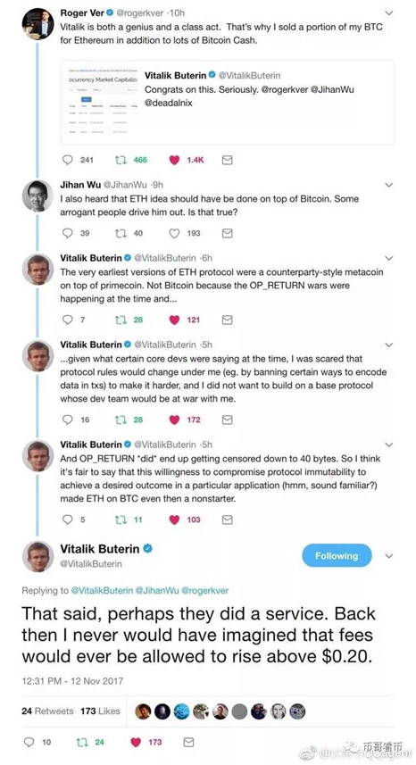
<center>图1</center>

总结观点：
BTC想当高手续费结算网络，稳定的黄金。这不太可行，在技术领域是很难通过先发优势获得持续垄断地位的，社会共识的自我强化，并不是一个稳定的状态。LN很难用，自己控制私钥时需要持续在线的观察节点预防欺诈，普通人很难去做一个稳定的服务端，此时需要租用一个甚至多个(如图2中LTC Lee所言)，这是鼓励权力垄断的。在诸多LN Hub服务中，一定是LN的开发组的产品能够获得最大的信任，并成为最大的LN Hub，其他节点也会具有社交垄断效应，有太多其他相关文章解析此问题，我不做更多叙述。

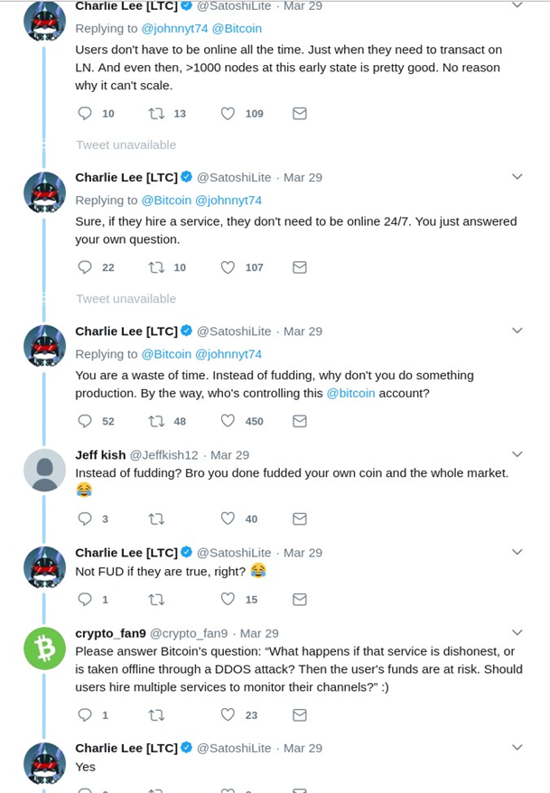
<center>图2</center>

BCH想要做现金，快速迭代试错新技术，为各种不同的特殊交易定制高级指令，协议不稳定。如去年升级的正则排序也并非是长久有益的，短期可能有些新意，有利于区块的压缩传播，方便开发人员编写并行验证代码，但会在特大区块时需要不断重构区块，耗费更多资源，比之RBF(Replace By Fee)更加严重，后续甚至需要改变更多的比特币底层设计，比如Merkle树结构。超多交易流时，排序为老的timechain类型，其实更加节省时间。简单讲，附加操作总是比插入操作更快速，后续我们会在Merkle部分详细说明。

BSV目标也有储值与现金，但不是直接核心目标，虽然很可能最终在这两个目标上做的更好。它的目标是优化价值信息的传递，成为一个公共的信息流总线，币只是这个总线平台的价值计量手段，当这个信息流平台越发流行，那么币就流通的越快并广泛，然后才能逐步具备现金的角色，现金这个角色是用出来的。当现金角色稳定，然后价格逐渐稳定，信息流引发黑洞效应，吸引更多信息集中到此平台后，平台的总经济活动产值，说大一点，与一个较大国家相当，那么它就具备了价值稳定的属性，就具有了储值功能。

总之，我相信，比特币的原初构架，Bitcoin SV，是要做一个价值与信息绑在一起流通的公共平台，所以它才会特别紧迫的需要超大区块。只有这个价值信息流平台工作好了，越发庞大，现金与储值属性是顺带着具备的，而不是通过技术实现的。

下面，转向对几个专题的讨论。

## 第1个话题，比特币区块链上的三层存储结构

首先，我们观看一下比特币的区块链的结构，如图3所示。这里我强调，链不是由区块组成的，而是由区块头组成的。另外的讲法是，区块是挂在区块头组成的链上。画一个草图(太草稿了TT)来更清晰的展示，如图4所示。正因为此，在这种链模型下，SPV节点，可以只接收区块头，来保有有区块链的所有安全特征，于己不相关的区块数据都是可以舍弃的。

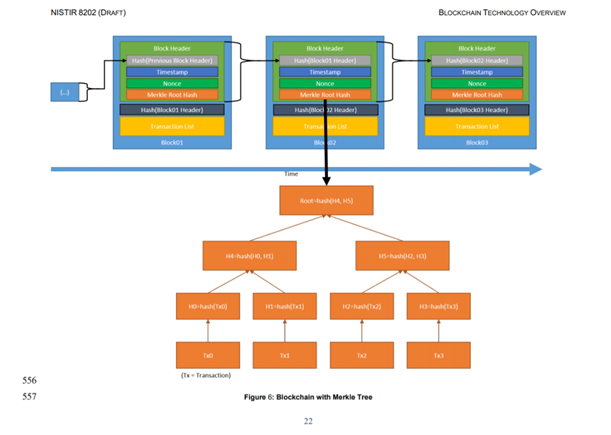
<center>图3</center>

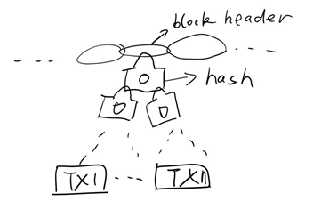
<center>图4</center>

我们也都经常耳闻，矿工不必存储所有的区块内容，而只需要存储UTXO集合，那是否矿工必须存储UTXO数据呢？或者，是不是，应该有一个共识的UTXO集合，所有矿工都必须保存？在本课讲的存储模型下，也不尽然。矿工存储UTXO，源于想要服务于这些未花费的交易，假如某笔交易的TX的内容是不合法的，或者是它的余额已经不支持，以合理的手续费，再次花费，那么矿工可以不服务于这些交易。当他不服务于这些交易的时候，他是否能够持续挖矿呢？当然是可以的，他仍然需要保存这些交易的哈希值，以便当其他矿工服务于此交易的时候，他能够将TX的内容与哈希值做对比，从而确定，这笔交易是合法的。所以，基于本课的存储模型，有这样一个结论，没有任何TX的内容，是必须要存储于任何个节点的，只有TX的哈希以及哈希的哈希，所组成的哈希的链，才是必须要存储的。

我这里可能打破了很多人，关于区块链存储是永久存储的这样一个好处印象，其实这是合规所需要的，同时也并没有完全摧毁这个好处，如果我们设计一个未花费的输出UTXO，它里面存有数据，而且，未花费的余额，完全支撑下一次的花费，那么矿工没有在TX合法的情况下把它删除的理由，因为存储是非常廉价的，尤其是磁带存储，特别是英特尔最近开发了一种，介于易失性RAM存储，与永久闪存存储之间的一种技术，3D XPoint，它具有很大的容量，同时在断电之后，不会被清除，而且读写速度很快，相应的技术会越来越多。

现在总结一下，有三层的存储结构，第1层是，我们只存储，数据的哈希值，此时数据具有隐私性，不在全网进行广播。第2层是，我们在OP Return操作码中存储数据本身，此时数据在全网内传播，但可以，被矿工无压力的删减。第3层存储是，我们构造非标准交易，在UTXO中嵌入数据，并使得余额高于未来可能需要的矿工交易费，数据在全网广播，同时，矿工将被激励，不删除此数据。

插入一点我对Metanet概念的理解：其应该引申于Metadata，分布式数据存储中的概念。Metadata是指存储的数据的数据，它描述了数据的位置等特征。那么Metanet应该指存储有数据的数据的网络，在这个网络中，可以轻松检索查阅所有数据的数据，而且数据是可验证历史真实性的（并非指数据内容对错）。全世界的数据内容本身，大多数并不适合以第3类甚至第2类存储，这里不同的存储层次要求是跟它的数据自身价值相关联的，数据应该总可以在这三层中找到一个比较合适的自身位置。

此话题最后，还需要清晰化一个事，非法数据上链的问题，在前面的基调下，链的存在与延续不需要任何TX数据内容的存储来支撑，链是由区块头而非完整区块来构造的，任何以上3种形式存储的非法数据，都是可以在所有节点删除的，包括矿工节点，也就不存在所谓的“非法数据上链了，链就会被污染为非法了”的问题。

## 第2个话题，图灵机、TX指令集与智能合约

图5展示了图灵机的结构，引用wiki：虽然图灵机会受到储存能力的物理限制，图灵完全性通常指“具有无限存储能力的通用物理机器或编程语言”。为鼓励思考，这里首先以不谦虚的态度讲，我们不要被图灵吓到了，图灵机并非什么高级复杂的东西，就是存储有一个Program释放指令，有一个读写头，可以对当前位置执行指令，然后有一个纸带去读写。而所谓图灵完全性，理论上应具有无限长的纸带，实际是并不存在的，任何机器都不可能具有无限的存储空间。所以，我们现实上只有图灵准完备。我这里定义准完备，是指技术上不惜一切代价是可以尽量趋向无限存储，这样我们不惜一切代价总可以计算一切可计算的问题。

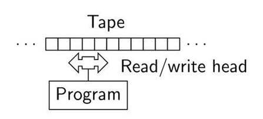
<center>图5</center>

以另一个视角，所谓“量子霸权”来说：传统计算机只能完整模拟49量子比特的量子计算的行为。甚至，300个量子比特的计算并行态空间就已经超过整个宇宙的原子数了，这也告诉我们，即便经典技术推到极限，当前的传统计算机也不是图灵完全的，现实已经遭遇挑战。

回归Bitcoin的脚本系统，以存储有限，经典状态有限的基调，来思考。比特币设计的脚本结构，两个Stack，是一个 2 PDA (2 stack PushDown Automata)系统。当了解到这一点，就可以理解，比特币脚本应该至少是图灵准完备的。

如下所述：
> The Bitcoin script contains commands, also called op codes, which enable the users to move data onto an alternative stack, also called the alt stack. The op codes are: 
• OP_TOALTSTACK which moves data from the top of the main stack onto the top of the alt stack. 
• OP_FROMALTSTACK which moves data from the top of the alt stack to the top of the main stack

在比特币的设计中，通过如上两个操作码(OP_TOALTSTACK、OP_FROMALTSTACK)，可将数据在两个stack的top位置上，来回移动，这种数据的移动完全等同于，图灵机当中的读写头在纸带上左右移动，我们可以图灵机的纸带(tape)当前位置以左等同于alt stack，而当前位置及以右等同于main stack，这样两个stack合并即为等同图灵机纸带(tape)，如图6所示。所以我们得到一个结论，比特币的脚本系统具有一个图灵机纸带。对于读写头的数学操作，加减乘除等逻辑条件判断，是显然具有的，只是部分被Core开发组禁用了。

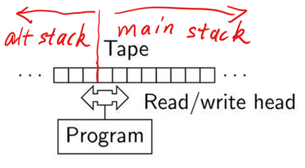
<center>图6</center>

接下来讲另外一部分，程序操作代码的存储与执行流程控制，比如一些人热衷的有限状态机。

经常听到有人讲，比特币是没有for循环的，然后，一系列所谓的非图灵的断言就都来了。但是可能很多人不知道，for循环在高性能计算中，是一个非常不好的概念，优化的代码编译器，会将一些简单的for循环拆成，重复的多个语句，比如将for i=0,: i<3; i++ : command，拆成 command(i=0) command(i=1) command(i=2)，这样减少了4个逻辑判断操作，以及3个自加操作，带来性能的提升。

例如对于GPU编程，它的逻辑操作运算，是比较弱的，在某些情况下，这种拆分是非常有必要的。此外，即便某些代码中书写了for循环，但实际上，在编译为二进制编码过程中，简单的for循环有时会被自动展开，变成了若干个重复具有不同index值的命令。

以上讲的是for循环的性能劣势。一般讲，for循环也优势，一是编程方便，二是减少程序的存储空间。但是，后者在脚本系统中反而是一种劣势，因为存储的减少，不正比于执行的时间，使得矿工在执行脚本之前，并不确定他的手续费是否匹配于它的计算量，使得，比如ETH，会遇到，执行是执行了，但是没有输出，结果没有上链，交易费也被花费了。而前者，方便编程，其实可以脚本编译器来实现。例如，用户编写的TX代码还是有for结构的，经过编译器的编译，我们就得到了循环展开的最终有效TX。

其实这里，不可避免涉及一个非常重要的问题：比特币等区块链系统，需要一个对所有输入都具有输出的脚本环境，换言之，程序不能够具备陷入无限循环的可能。Bitcoin系统为此煞费苦力，构造了一个具有完全函数(Total Function)性质的完全图灵机(Total Turing Machine)，即一种对任何输入都会终止的图灵机，来解决这个问题。

然而，有人偏偏热衷于通常的图灵完备实现路线，以“有限的状态机(Program)即可达到无限不停机的计算”来作为图灵完备的必要条件。这在实践上是狭隘的，如果放弃有限的指令存储空间这个限制，那么不需要循环结构也可以趋向无限的计算能力，循环可以取代以自动化的编译展开，从而可趋向可解决任何可计算问题，这种能力才是图灵完备的核心，何况大家都是实践上准完备的，如ETH也由于gas限制，不可能达到无限循环的计算。
所以，在比特币的脚本场景中，for循环不会是一个好的设计，是不应该加入的，而应该代以，重复所需要的执行个数个指令。对于其他循环结构，这里不再赘述，在话题链接中，已有对多种典型递归函数的代码实践。

至此，应该理解，只要具有足够大的TX指令空间与Stack空间，比特币的TX脚本系统是趋向图灵完备的。但是，比特币是基于判断消费许可型的TX，是一个程序脚本合约，类比纸质打印的的程序代码，当交易结束，TX计算中的Stack，也就是纸带，被销毁了，所以状态被清除了，也就无法被下一个TX引用，关于如何将这个中间的某些状态保存，或者做成一个输出，将一个TX分成两半，等等，我不知道是否能够有一种方法解决这一个难题。

但是从另外一个角度来考虑它，只要解决这个难题，那么必然也是要所有节点全部去运行一遍这个程序，太多的中间状态带来存储压力，这就与ETH没有什么分别了，应该也会遇到扩展性的问题。

**谈另一个构思，有状态智能合约的运行模型**

以太坊智能合约的优点，主要是具有去信任的执行机构，去信任是核心，而上链执行，并不是核心。比特币，给了我们一个，所有人可以自由出入，且积累信用的这样一个公共的总线，我们可以设计一个平台，将若干部分节点包罗进来，随机选择多个节点，以门限签名、交叉验证的方式，来构造一个挂在链上，但并不是寄生生在链上的，同时具有去信任的智能合约执行环境。

举例为证，比如FOMO 3D游戏(不讨论它的合法性)，用现在的BSV平台就可以，我们可以做到一开始就开发好程序，程序一启动就可以不修改了：

1. 在这个活跃节点池中，选择几个节点(或矿工)，向他们获取多重签名地址，我打钱。
2. 几方矿工/全节点执行程序。
3. 一旦又有一个资金入账，执行程序，可基于Bitcoin总线，交叉验证执行结果。
4. 验证正确后，向总线请求当前活跃节点列表。
5. 程序确定下一次执行程序的几个节点的地址。
6. 向他们付款，同时收取应用手续费。
7. 循环开始

这里节点池可以是动态更新的，比如是最近的几名矿工，都可以程序内定，程序的执行结果是交叉验证的，资金转移是在结果确定一致后，一起签名的，或者是门限签名等等。运行节点的个数也可以预先定义的，开发者自己觉得几个节点保险，就在程序中设定几个，当然节点越多，运行越安全顺畅、防单点故障，同时付出的服务费也就多些，风险都是可以控制到自己需要的大小。智能合约的安全程度是与想要付出的服务费正相关的，且可以平滑的连续调节，不像ETH等等，总是固定的高安全、高耗能。用户体验，会比ETH好多了，速度会杠杠的。

**谈BCH 与BSV对比特币OP操作码的演化态度区别**

前者希望得到一个复杂指令集，一个可以由自上而下的人治开发组控制的集合，在适当的时候可以获取开发者优势(不管是否主观承认，还是没有意识到)，而BSV希望得到一个图灵的，精简的指令集，趋向于不受任何团体控制。

基于以上图灵机的基调，BCH引入的新操作码OP DSV的功能，原理上，总可以通过对精简指令的编程来获得，也的确有人给出相应的脚本实践，未来TX内部的各种新式高级OP操作需求也总可以通过精简指令编程来代替。如图7中中本聪所讲，比特币从0.1版开始，就坚若磐石(set in stone)，应以指令脚本模板，而非不断扩充专门代码(special support code)的形式，支持未来的非寻常特殊交易。

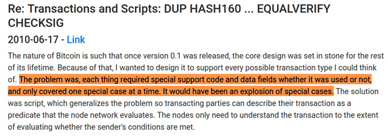
<center>图7</center>

谈到这个复杂与精简的区别，还要讲，他们的优劣势，复杂指令集意味着交易TX更小。也就是说，高级应用的TX，与普通转账的TX，具有相同的优先级，甚至某些高级应用的TX，因为具有更小的交易费用，**这将在区块大小达到技术与网络极限后，挤压普通转账的TX空间**，会使得链上跑的大多交易是公司的高级合约业务，而不是普通人的日常生活交易。
结束图灵机、智能合约这部分讨论。


本话题参考：

https://zh.wikipedia.org/zh-hans/%E5%9C%96%E9%9D%88%E5%AE%8C%E5%82%99%E6%80%A7

https://en.wikipedia.org/wiki/Turing_completeness

https://www.zhihu.com/question/20115374

https://en.wikipedia.org/wiki/Machine_that_always_halts

https://medium.com/@craig_10243/bitcoin-a-total-turing-machine-5a6c3c68f5a7

https://nchain.com/app/uploads/2018/11/turing-complete.pdf


## 第3个话题，Merkle树与CTOR的矛盾

参考：

https://www.deadalnix.me/2016/09/24/introducing-merklix-tree-as-an-unordered-merkle-tree-on-steroid/

https://bitco.in/forum/threads/gold-collapsing-bitcoin-up.16/page-1236

阿毛里对CTOR的青睐由来已久，其实更远的将来，他是想要替换比特币的merkle树为merklix树，这完全改变了比特币的区块基因，并带来更远未来的扩展性的问题，即便当前可能有一点优势。

如上链接里，阿毛里讲：
> We can insert, delete or mutate an element from the tree (Merklix) in ln(n) time. A Merkle tree require o(n) to do so. This tree is more efficient to work with.

如图8所示是merkle结构，图9所示是merklix结构，如前英文所讲，后者的插入操作，比前者具有很大的优势，由O(n)，提速为O(log n) ，因为在Merkle下，每次插入，都要平移后面的Item，需修改后面的所有交易的Hash树结构。在CTOR排序下，插入变得经常，这个结构改变是非常有必要的，所以未来，BCH不可避免要更改Bitcoin最核心的Merkle树结构设计，至少会激烈讨论起来。即便是O(log n)，也会在极大区块时，很大倍数的增大操作的时间。

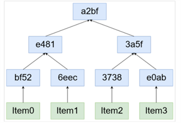
<center>图8</center>

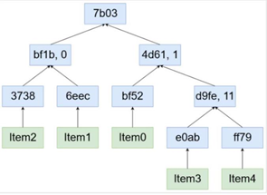
<center>图9</center>

容易如此计算：

```
10^12 byte / 250 (byte/tx) / 600 s = 6,666,666 tps
6,666,666 tps / 6 tps  ~ 1,048,576 =  2^20 
```
即1T byte区块下，交易约6,666,666 tps，区块进行一次O(log2 n)的操作，将会比当前(可假设6 tps) 增大20倍hash工作量。虽然hash是蛮快的，但是，除了这个20倍，在CTOR下需要做的插入操作数量与n同量级，所以整体操作复杂度应为O(n log n)。具体这里应该有个performance benchmark估计，目前并未看到此类数据，预计这会造成较大的影响。图10展示了Shadders对此问题的解释(Shadders是NChain的核心码农)。

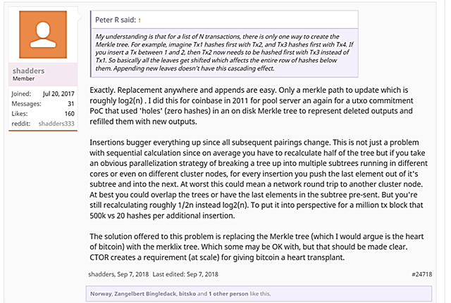
<center>图10</center>

在BSV的开发路线上，merkle的插入是更困难的，这导致矿工实际会避免去做这个操作，而是对每一个进来的TX，总是附加到Tree后面，此附加的过程也可以并行化，因为是树型的，可以独立处理多个分支。这就带来了TX事务是时间序列化的好处，这是矿工受激励得到的特性，具有经济学上的稳定性。

所以争议性CTOR的仓促添加，并不确定能够给系统带来长久的好处，还带来了更多后续的根本协议更改需求。协议是需要稳定的，只有其无法工作，具备毫无异议的问题时，才应该提上修改日程表。任何有可能避免的争议变更都会给开发者社区带来混乱，都会制造不平等的竞争优势，或带来不可弥补的后续隐患。

## 第4个话题，**非通胀模型**与**绿色经济**与**大区块**

现代经济，以通胀来贬值存储。以贬值存储来，催促人们去快节奏的紧张工作，催促资本，尽快投入再生产或者新技术，而不是，慎重的加以考虑投入的再生产或者新技术是否高概率能够带来收益，因为如果不尽快投资的话，手里的资产就贬值了。这种快节奏的工作与投资，一方面加快了有意义的产品技术的迭代，另一方面也使得意义不大的产品技术被过度投资，投资效率低下，加剧了资源的浪费。

非通胀模型，将导致人们更加谨慎的看待投资，自己劳动收获的价值可以更长久的得到保存，那么就可以在未来投入更有价值的地方。从一方面来讲，也可能会使得新技术的投资趋向于谨慎，而稍稍变慢，但是定然更加具有可持续性，也就是收获了绿色经济。

此外在区块链系统下，一定必须要加速有价值信息的传播（Metanet可以在此发挥巨大作用），降低信息不对称，使得更多有少量资产的人也能够分辨，自主的寻找有价值的产品，进行投资。从而改变新技术总是仰仗于大资本投资的现状，以此来抵消，由于持有不贬值，而带来的投资衰退。当区块链系统促进信息的对称的传播，有价值的信息可以抵达所有人，以用户的视角来投资新技术，新产品，或会带来更快更有质量的技术迭代。

非通胀的模型下，另一方面，会一步步减少挖矿的资源浪费，直至相比人治系统更低，并消除任何不必要的能源浪费。人类的自由意识，将被释放到账本维护以外，更需要智力的生产领域。

首先，非通胀必须结合超大区块，在小的区块与有限的手续费下，没有铸币，维护账本就无利可图，就变成了一种公益行为，不会带来经济学的激励稳定性，不会带来对成本的竞争优化。假设只提高手续费，又会将用户推到其他的账本系统，所以只有极大提高区块大小、极大提高交易通量、保持低极低手续费一个路径，如图11中中本聪所言，比特币的节点，最后只会剩下大的服务器矿场，这里我们理解为算力矿池与大数据服务中心，两者很可能应该是统一的。

当未来区块达到TB量级的时候，存储成本也是很大的一部分成本，承载的交易量越大，算力成本占比就越加微小，最后以一小部分的算力能源成本，带来了同样很大的安全绝对值，被所有交易等值的共享，这是非常划算的。而一旦加入通胀的模型，那么算力成本当中，就不全是使用成本，还有铸币成本，而当前的铸币成本与等量价值纸币铸币成本要高多了，以大量的电力消耗来支撑。

总之，消除铸币成本，需要非通胀的模型，而非通胀的模型下，需要极大区块支撑算力，极大区块下，算力不再是主要的成本，也不再是浪费，其大小完全只来源于交易的安全需求大小，结合至少同量级的存储成本，构成了总的交易成本，这里的算力与存储成本，都是有益的，也都可以通过竞争来获得最佳成本。

我的分享结束，希望大家给予指正。

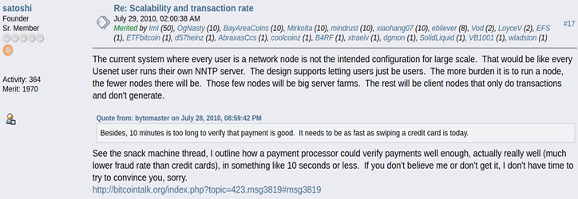
<center>图11</center>


以上内容根据2019年4月14日在BSV学习群直播后整理而成，最后，我想加几句感言：
不管你是关注还是忽视，比特币的设计路线图一直在那里，在中本聪的论坛记录与白皮书中，不会因为核心开发组的路线变更而改变。
[https://nakamotostudies.org]
[https://satoshi.nakamotoinstitute.org/quotes/bitcoin-design/]
比特币是涅磐重生，或只是昙花一现？且看当前是否有足够多的志同道合的智力投入其中，是否有关键应用可堪重任！


## 问答

问：请问，如果链上只保留区块头，区块链其实是“区块头链”，这与我们现在所说的区块大小扩容是什么关系？是否可以理解为：“出块”的时候，和广播出去被他人验证的时候，区块是包含头和身子的，体积可能非常大；当它成为了一个旧区块的时候，各节点可以酌情自行把身子部份删去以节省空间？如果这个理解是对的话，那么我们发到链上的那些内容，如果没有特别处理，它的哈希或被它影响的哈希会一直在链上，但它的内容本身会在多久以后被删除呢？

目前，全节点/矿工应该还没有开始删。比如我用bitpaste传的内容，现在都能访问，说明bitpaste背后的全节点暂时还没有删这些原始内容。我想问的是，“需要自己找接入商保存原始数据”的时代会很快到来么？
答：矿工传播区块，是让他人对hash树的有效性做验证，这个验证，是验证TX，所以区块必须全网转播，最近的区块总是需要临时存储。对于自己搭建的全节点，预计在6TB区块总量以下，应该不会有删减。对于某些大存储虚拟主机VPS，可能只有约500GB，而当前区块具有173GB，剩下300GB空间，可以供1MB区块使用6年,供平均2MB区块使用3年，更有意义的估算需要拟合增速模型了。不过2-3年后，ipv6普及了，自己搭建服务器应该不是太难，至少独立ip估计不是问题，提供数据服务的非vps全节点会更多，这类全节点还是会轻松6 TB的，暂时就不会有太大删减压力。

问：FOMO 3D 合约平台那里不甚明白，可能更多解释？

答：本质上，Bitcoin提供了一个去信任的平台，我们可以在比特币的节点网络之上，构造更上一层的拜占庭容错共识子网，在这个子网内，我们可以以不影响主网且安全程度弹性可控的方式，来构造任何去信任应用，不需要全部矿工/全节点都检查执行一遍，所需要的只是一个自动下载部署的自动化执行环境。甚至EOS这个网络就可以改造成比特币的上层子网，只是EOS的收费与节点选择是基于EOS代币计价与投票的，然而也不难换成Bitcoin/SV。_unwirter构思的Planaria平台属于极精简的一类，只能提供本地单节点的执行，提供需信任的API服务，没有多节点池、多签、交叉验证，同时开发应用过程中还需要搭建全节点。只有当开发调试比特币网络应用不需要自己控制的全节点时，开发生态才能快速扩张壮大，提供这种开发调试平台未来可能具有比较大的盈利模式，这与当前开发几乎都基于自己控制的执行平台有很大的习惯性区别，也是比特币网络应用的魅力所在，这不仅是一个记账网络，也可以是一个节点分布、模块分散的云计算网格，当前的完全集成的云计算系统/APP应用商可以被打散，没有人可以完整的控制它，每一方都可以在这里找到适合自己优势的位置，以更加专业细分的形式参与竞争。


Bitcoin/SV Address：1PwCe2W28i1ymYGaHUDWoQTbQiat5B97b6.

Copyright (c) 2021 Wenshuai

Shield: [![CC BY 4.0][cc-by-shield]][cc-by]

This work is licensed under a
[Creative Commons Attribution 4.0 International License][cc-by].

[![CC BY 4.0][cc-by-image]][cc-by]

[cc-by]: http://creativecommons.org/licenses/by/4.0/
[cc-by-image]: https://i.creativecommons.org/l/by/4.0/88x31.png
[cc-by-shield]: https://img.shields.io/badge/License-CC%20BY%204.0-lightgrey.svg
