# 使比特币交易具备持续遗传进化能力的一个改进呼吁

作者： Wenshuai

版本： 3.0

修订时间： 2024-02-25

<style>
pre code,
.md:not(.use-csslab) pre code
{
white-space: pre-wrap;
word-wrap: break-word;
text-align:left;
}
</style>
<span id="top">

## 摘要

本文讲述由一层Token方案引发的比特币改进建议。其不仅对Token具有重要意义，更对整个比特币网络中的可遗传的交易（TX）的进化能力有关键的影响，所以，题目中讲 “ **其使比特币交易具备遗传进化能力** ”。不夸张的说，比特币网络中，所有需要成长变化的交易数据都将受惠于此改进。

本文呼吁的改进，是在不影响UTXO模型可扩展性的前提下，实现比特币**系统完备**能力的必要一环。比特币的脚本系统确实已经图灵完备了，其完备涵义的前提是一个假设：我们具有一个无限长的纸带（磁盘与带宽资源）。与此完备概念有所区别，我所强调的**系统完备**是在实用层面，其准确涵义是： **本提议将使比特币脚本的图灵完备能力可以在有限的纸带上具备充分且必要的实用性** 。其充分必要的含义有：接近极限的数据资源（存储与带宽）利用率、必不可少的数据资源回收（数据裁剪）能力，本文后续将解释这一点。

为获得以上益处， 初期**仅需要一个优雅、简单、一劳永逸的小改进** 。此提议的最小版本可以简短清楚地表示为：

<pre style="code">
将TXID的计算公式由

TXID = HASH( HASH( TX-Version:<mark>1/2</mark>,      <mark>UnlockingScript</mark>, OtherTxData ))

改为

TXID = HASH( HASH( TX-Version:<mark>3</mark>,  <mark>HASH(UnlockingScript)</mark>, OtherTxData )) 

[手机中可左右拖动查看]
</pre>

<span style="color:red"> 本提议仅包括两个部分：a) **将比特币交易中的版本号由当前的 1/2 改为 3 **，b) **将计算 TXID 所依赖的数据序列中 Inputs 的解锁脚本数据 UnlockingScript 改为使用其 Hash 值**。因为我们将 TXID 中的 2 级 Hash 改为了 3 级 Hash，所以此改进可称为 **TXID-3LevelsHash** 提议。 因为 TXID 计算过程是一个不可逆的过程，所以此 Hash 计算的单向变化不影响任何其他部分的程序逻辑，不影响矿工使用包括 UnlockingScript 数据在内的 TX 全文做脚本验证，不影响 SPV（简单支付验证）等等。
</span>


我相信本提议亟需在比特币网络中实现，且一旦得到实施，Bitcoin 系统则因具有实用化的图灵完备能力将可以在未来自行进化发展，<span style="color:red">**将真正具备协议固定的能力** </span>（类似椭圆曲线加密算法不再安全以后的签名算法改进另当别论）。应当强调：<span style="color:red">协议只有具备**可固定**的客观技术能力，才能达到**其将固定**的社会共识</span>。

以下将详细解释上述论点，**因希望零技术基础的圈外人依然能够理解全部逻辑与原理**，所以文中简洁的描述了所有必要的基础知识，部分读者跳过前面的章节（起因赘述、技术基础），查看红色字体部分，或直接从“比特币改进提议”一节看起，同时请特别关注文章结尾附近的遗传进化逻辑延伸。当遇到名词理解困难时，可以尝试跳转至 [名词解释](#mark) 与 [比特币交易数据结构](#preimagetxdata) 处查询（最好预先阅读名词解释）。


## 本文起因

 **一个改进提议的发起，其起因动机经常涉及各种利益关联，我希望完整的讲述其缘由，来表明本改进提议的单纯动机。** 

自2020年9月初，[**sCrypt**](https://scrypt.io/)公司的刘晓辉同学提出了一个[**点对点的一层Token解决方案**](https://xiaohuiliu.medium.com/peer-to-peer-tokens-6508986d9593)，
其仅依赖矿工即可以实现Token的安全交易，具备如下几个关键的应用优点：

 1. 因为不需要第三方的Oracle参与， **使其仅需要最小的信任依赖** 。
 2. 因为不需要第三方的Oracle参与， **使发行Token变得非常简单** ，任何人都可以在自己喜欢的任何钱包中构建一个简单的交易（接近0成本）来创建全平台兼容的Token。
 3. **兼容SPV**（简易支付验证），可使用Merkle Path简易的验证交易，**是Token可大规模扩容的关键**。

以上三者是同等重要的，为达到快速的推广应用而缺一不可。特别需要提到第2条，其很容易被忽略被妥协。ETH Token之所以成功占据大部分市场，其重要之处在于其首先达到了“Token发行的简便性”，这是一层Token的核心竞争力，此特性或许比“去中心信任”更加重要，这使得我认为**此类一层Token是必不可少的**。

但是，开发者们热烈讨论后，发现**此一层Token方案具有交易膨胀问题**，其每一次的Token转移都要携带自Token发行交易始的所有交易的全部数据，随着Token在用户间的持续转移，最终不可避免其体积大小变得不可接受，这是推广实用时不可接受的缺点。

在参与讨论的过程中，[我提出了一种二次Hash的办法](1_txid_new_hash_proposal/p2pToken_chat_history.jpeg)来解决这个问题，其需要配合TX版本升级来实现，提议受到邱同学的理解支持。但多数人对一层Token必要性的怀疑以及对协议变更的担忧，而没有考虑到本改进提议的优雅、简洁、一劳永逸、影响巨大等特征，最终我的改进提议并没有得到更多的响应与细细思辨。

部分人希望我写出文字，详细的讲述解决方案，但源于以下因素，一直没有提笔：

- 本技术改进提议非常简单，不需要写文章，只要关心的开发者认真考虑下即可理解。
- 开发者们对可立刻着手构建的二层Token（有讲带Oracle的一层Token）比较感兴趣，并不热情的关心共识版本的变更。
- 一层Token的方案与开发是利他的，自身推动其实现需要消耗精力，其他人使用起来是平等简单的。
- **我的参与完全出于业余爱好，没有任何改行至区块链产业的近远期计划，在家庭与工作繁忙的情况下动力不足。** 
- 本人对Token生态并不是特别的关心，其是很重要的热点，但与我着重思考的一种应用生态方案关联不大。
- 只要给些时间，其他人会发现二层Token的问题，就会自然的重发现（发明）本文提议的方法，并非必须由我来推动。

但是半年过去了，我越发坐不住了，原因多方面如下：

- 虽然提议对开发者是非常简单的，但应该写一篇0基础需求的文章，让不做开发的人也能理解这个改进的**简单并重要**之处，一起推动它的实施。
- 在[Open BSV License version V3](https://github.com/bitcoin-sv/bitcoin-sv/blob/master/LICENSE) 发布以后，希望借推动此协议来测试其开放性，避免将来出现生态陷阱的可能性。
- 近半年一层Token的极少进展与此瓶颈对热点应用的限制，影响了BitcoinSV的发展，也就影响了我对比特币改变民众生活的远景信心，难以忍受现状。
- 其他团队针对一层Token的改进提议应该没有本提议简洁与优雅（欢迎质疑）
- Token热点是事实，在其他区块链在性能问题上出现系统级无解时，比特币系统亟需抓住机会，展示问题解决能力。此时机越发紧张，因为，当大多数圈内参与者被迫接受ETH二层Token后，即便一层Token更具便利性，也难以让已经付出巨大成本的开发者再次迁移。
- 原计划在假期写出来，奈何拖到假期末。但是，拖延不能变成食言。
- 或许一位不会在将来参与/另立一个私有企业的人，才是此事的最佳发起人，以消除任何夹带私货或寻求优先位置的可能性。

所以愿意通过本文尽可能的呼吁此提议，希望它得到实施。

<br> 

## 技术基础知识

我们开始一点点拨开技术的迷雾，理解比特币的一层Token智能合约并不困难。

在讲一层Token之前，我们需要先首先讲一下比特币的智能合约的核心概念 “**OP_PUSH_TX**技术”，而在此之前，我们还需要讲一点点比特币的脚本运行原理。

因此，以下倒叙展开，相信我，这些都很简单。说简单并不等同于篇幅短，额是指所需起点与技术基础低，因而反而更长，以使逻辑严密，不需读者脑补缺口。但每一小段都很简单，所需能力仅为注意力的集中。**仅集中注意力一个小时，就可以完成技术的入门，并直达前沿，不再混沌，这会很超值**。


### 比特币脚本程序的运行方式

当前的比特币脚本，通常是长度很短的一些代码，且不像传统高级程序语言那般具有很复杂的跳转结构，而是顺序的执行，如同一个数学算式一般，并不复杂，反而比一般的计算机程序更简单易读。

以最简单的数学算式： `1 + 1` 为例，其在比特币脚本中，表达顺序变为 `1 1 +` ，我们可以将 `+` 理解为一种最简单的函数，其在比特币脚本术语中称为操作符（OP_CODE）。因为操作符有很多，无法只用单个字符来完整的描述，为方便识别，`+` 在比特币脚本中以 `OP_ADD` 表示。所以，最后的脚本表达式为`1 1 OP_ADD`。比特币中的操作符（函数）总是对其左侧预定数量的输入数据进行加工处理，然后返回预定数量的数据值。此外，只还需要知道：比特币脚本的运算结合律为从左到右顺序执行操作符（如果将其上下排列，此时则为自下而上顺序执行），最后得到的**数据序列**即为执行结果。本段示例表达式的执行结果自然为单个数字：`2` 。

- **又例如** 
`1 1 OP_ADD 3 OP_MUL` ，
其中 `OP_MUL` 为数学中的算术乘操作（其对左边近邻的2个数值做乘法，然后返回一个数值）。
其首先执行 `OP_ADD`，得到中间结果：
`2 3 OP_MUL`
，然后执行 `OP_MUL` ，得到最后的执行结果为 `6` 。

- **再举一个执行结果为数据序列的代表例子** ： 
`1 2 OP_DUP`
，其中OP_DUP的含义是复制左侧的单个数据，也就是复制 `2`，得到双份数据，所以其执行结果为 `1 2 2`，是3个数值组成的一个序列。

- **另有许多情况下，比特币脚本中的数据不是一个数值** （如1、2、3等），而是具有某字节长度的字符串（16进制表达），但仍然被视为一个输入数据（也可将其理解为一个很大的正整数），在脚本表达式中，每个输入数据间会用空格隔开。

至此，只要我们在遇到未知OP_CODE时，[查找一下其定义](https://en.bitcoin.it/wiki/Script)，便基本能看懂比特币的脚本了。

当比特币脚本中的指令执行完毕，所得的结果中最后出现的数据（如上为最右）为非零，则此脚本验证成功（等于OP_TRUE），此验证相对应的 UTXO (unspent transaction output) 即可以被花费，余额也将转移。因为涉及经济利益，实际中的验证脚本并非如上面的算术计算脚本一般简单。

将整个验证脚本分成两半，右边部分一般为操作算符，可称为Lock，因为其一般由父交易提供，用于锁定UTXO余额，使不被轻易花费；左边的部分一般为数据，可称为钥匙Key，因为其一般由即将上链的子交易提供，用于解锁UTXO余额。如果仅考虑 `1-input-1-output` 的交易，其过程可用下图表示：

<!--
 ```mermaid
graph LR 
    Input3_Key==解锁验证==>Output2_Lock
    Input2_Key==解锁验证==>Output1_Lock

    subgraph Tx3 
    Input3_Key---Output3_Lock---Output3_Value
    end    

    subgraph Tx2 
    Input2_Key---Output2_Lock---Output2_Value
    end

    subgraph Tx1 
    Input1_Key---Output1_Lock---Output1_Value
    end
```
-->

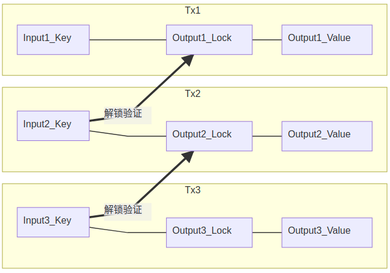


<center>比特币交易链的结构</center>

<br> 

### P2PK交易 与 OP_CHECKSIG 操作符

为理解下一章中的 **OP_PUSH_TX** 技术，我们还需要理解比特币中最简单常见的一段代码，其是P2PK交易 (pay-to-pubkey transaction) 的核心解锁验证代码：

<span id="code1">  </span>
```html
代码块(1):
<Signature签名>   <PublicKey公钥> OP_CHECKSIG
└ ─ ─ ┬ ─ ─ ┘  └ ─ ─ ─ ─ ─ ─┴─ ─ ─ ─ ─ ─ ┘
    Key                    Lock
```

其中` < ... > ` 表达一个字符串输入数据，其意义由 `< >` 中的文字所表达。

本代码中，OP_CHECKSIG 表达一系列计算操作组合成的单一操作符，是比特币系统中自带的最重要的原生操作符之一，其首先对当前的TX部分输入与输出数据 <**TxData**> 做HASH计算（两次SHA256计算,与操作符 OP_HASH256 的功能相同），得到 <**Tx_HashValue**> ：
<span id="code2">  </span>
```html
代码块(2):
<Tx_HashValue> = HASH256( <TxData> ) 
```

然后读入左侧的两个输入数据 <**Signature签名**> <**PublicKey公钥**> ，检查 <**Signature签名**> 是否是由 <**PublicKey公钥**> 对应的私钥 <**PrivateKey私钥**> 对 <**Tx_HashValue**> 进行签名得到的，返回真假判断。 **OP_CHECKSIG 是比特币系统中极为重要的一个操作符** 。

我们可以顺便理解一下比特币支付背后的交易生成、提交与验证原理。首先，将以上 [代码块(1)](#code1) 分成两段： `<Signature签名>` 与 `<PublicKey公钥> OP_CHECKSIG`，前一段只有数据没有操作符。然后，将后一段代码放入交易的Outputs中（即为一个UTXO，等同于生成一个未开过的**脚本锁**），并为其分配比特币余额，即完成将比特币发送到 持有私钥 <**PrivateKey私钥**> （ 其与 <**PublicKey公钥**> 对应配对） 的人的手中。当接受人花费此余额时，即利用手里的 <**PrivateKey私钥**> 对 <**Tx_HashValue**> 进行签名得到 <**Signature签名**> ，然后利用此签名作为**钥匙**，与后段代码（**脚本锁**）组合起来，提交给矿工网络去执行验证， 矿工们通过执行 **OP_CHECKSIG** 操作符完成认证检查，即完成解锁操作。解锁之后，交易发送者一般会同时构造另一把新锁，如此交易迭代下去。

<br> 

### OP_PUSH_TX 技术： 一层Token方案的核心

**OP_PUSH_TX 技术在比特币脚本合约中的地位极为重要**。利用它可以在构造比特币交易的时候， **对币的接收者未来发出的后续交易的输入与输出数据均做出限制，实现对后续的一系列子孙交易施加影响（提约束条件）** 。这种能力被大多数区块链开发者（包括BTC开发人员）认为是不可能的，成为ETH链上账户模型出现（被赞赏）的缘由。


前面对P2PK交易的介绍中，利用 <**PrivateKey私钥**> 对 <**Tx_HashValue**> 进行签名获得 <**Signature签名**> 的过程，是由用户在花费比特币余额时在比特币脚本外执行（为保持 <**PrivateKey私钥**> 的私密性）。

在OP_PUSH_TX 技术中，类似的签名操作利用图灵完备的比特币操作符在脚本内完成，此时选择一个可暴露的另一个 <**PrivateKey私钥2**> 来做签名，整个签名过程完全爆露在公共的空间中（不影响OP_PUSH_TX技术安全性），可以用一个虚构的操作符 OP_Signature 来表示签名计算。完整的过程由以下代码表示：

<span id="code3">  </span>
```html
代码块(3):
<TxData(解锁时输入)> OP_HASH256 <PrivateKey私钥2> OP_Signature <PublicKey公钥2> OP_CHECKSIG
```

这里，  OP_HASH256 操作符跟 [代码块(2)](#code2) 中Hash函数具有一样的功能（两次SHA256计算）。在执行完 OP_HASH256 后，中间结果为：

```html
<Tx_HashValue(待验证)> <PrivateKey私钥2> OP_Signature <PublicKey公钥2> OP_CHECKSIG
```

其中用 **OP_Signature** 并不是一个比特币脚本中自带的操作符，而是被用于表示使用一系列已有的 OP_CODE 组合而成的一段脚本代码的整体，其计算操作集合为一个单一函数，读入左侧的两个数据，进行椭圆曲线签名运算，计算结果为 ` <Signature签名2(待验证)> `，此函数库代码由sCrypt公司的脚本编译器内部实现。执行之后的中间结果为：

```html
<Signature签名2(待验证)> <PublicKey公钥2> OP_CHECKSIG
```

这时的脚本跟前面解析过的 [代码块(1)](#code1) 是相同，这里最关键的注意点是， **OP_CHECKSIG** 操作符会由矿工执行，读入当前Tx，得到真实的 <**TxData**> 数据，然后再次计算出 <**TxHashValue**>， 如果**OP_CHECKSIG** 验证通过，则说明 <**Signature签名2(待验证)**> 所签署的数据 <**TxData(解锁时输入)**> 确实是跟当前Tx一致的真实的 <**TxData**> 数据。作为对比理解，同样的OP_CHECKSIG操作，在P2PK交易[代码块(1)](#code1) 中的目的是验证Tx发出者是否拥有正确的<**PrivateKey私钥**>，而在 OP_PUSH_TX 技术中的目的是验证Tx发出者是否在当前交易的输入中插入了正确的包含当前交易输出 <**TxData**\> 数据。

因此，通过将 [代码块(3)](#code3) 中除第一个数据 <**TxData(解锁时输入)**> 外的其他数据与代码放入UTXO中，就可以要求花费该UTXO时，必须要输入正确匹配的 <**TxData(解锁时输入)**> 数据，才能获得验证通过。因 <**TxData(解锁时输入)**> 中包括当前交易的输出数据 <**TxOutputs**>，通过其他比特币的字符串操作符（如：部分提取OP_SUBSTR、相等验证OP_EQUAL等等），即可对当前Tx的<**TxOutputs**>添加验证要求。

小结一下，**我们可以构造一个Tx1，在其中的UTXO1中写入OP_PUSH_TX相关代码，要求接收者在构造新的Tx2、花费此UTXO1时，输入正确的<Tx2Data\>，同时写入对其UTXO2部分数据的各种图灵完备的验证要求，对新生成的UTXO2做出限制。该限制条件仍可以被UTXO3继承，然后链式的持续遗传下去。** 

我们可以把 [代码块(3)](#code3) 中的 <**TxData(解锁时输入)**> **OP_HASH256** <**PrivateKey私钥2**> **OP_Signature**  代码转换为形式 <**TxData(解锁时输入)**> <**PrivateKey私钥2**> **OP_PUSH_TX** 。即用封装的单一函数 **OP_PUSH_TX** 完成 **OP_HASH256** 与 **OP_Signature** 的作用，这个 **OP_PUSH_TX** 也不是比特币脚本自带的操作符，其 **OP_** 前缀仅表示改技术具有单一的功能，并可已类比原生操作符的方式在 sCrypt 公司的产品中被调用，sCrypt 编译器会自动完成真实操作符代码的植入工作。

<span style="color:red"> 至此，我们解释了 OP_PUSH_TX 技术背后的原理，我们得到了一个非常重要的知识，**比特币脚本可是实现对还没现身的未来后续交易Tx做出限制，其可做出限制的数据范围即为** [代码块(2)](#code2) 中Hash函数的输入数据 <**TxData**>，**此数据被称为交易原像（Preimage）**，其不是完整的Tx数据（至少不能包含签名数据自身），但是却是当前Tx中最值得使用签名去保护的有关键意义的数据。</span>

因为Preimage表达了 OP_PUSH_TX 技术的可操作数据空间，对认识比特币智能合约的能力边界非常重要，所以至少需要对其有一个简洁清晰的理解。

<br> 

### Preimage 与合约脚本的可操作数据边界

所谓 “**巧妇难为无米之炊**”，比特币脚本(Script)为巧妇，可输入数据（InputData）为米，**即便脚本能力很强（图灵完备），其可操作的数据的信息多少与密度仍是极为重要的独立组成部分**。通过本节，可以详细的了解比特币合约脚本的输入数据的边界范围。不想细看的读者可直接跳转至本节后面的示意图与总结的所有可操作数据。

将比特币下基于UTXO的智能合约理解为：**验证一个钥匙（也可分割为多个）是否与设计好的锁匹配**，此过程可表达为验证此函数等式：

<span id="math1">  </span>

```html
公式(1)：
Lock_In_TxPre( <Keys_In_TxNow> ) == True 
```

是否成立。其中，TxNow表示当前正在执行验证与上链的Tx，TxPre表示正在花费的 UTXO 所在的前一个Tx。


一个特别有意义的合约设计基础知识是：其中 `<Keys_In_TxNow>` 参数的可变空间范围，它决定了智能合约的能力边界，因为脚本锁（Lock_In_TxPre）是可以被任意构造的（源于脚本的图灵完备性）。

Preimage 是 OP_PUSH_TX 技术为 `<Keys_In_TxNow>` 带来的新的参数空间， 
其包含如下内容：

1. nVersion of the transaction (4-byte little endian)
1. hashPrevouts (32-byte hash)
1. hashSequence (32-byte hash)
1. outpoint (32-byte hash + 4-byte little endian)
1. scriptCode of the input (serialized as scripts inside CTxOuts)
1. value of the output spent by this input (8-byte little endian)
1. nSequence of the input (4-byte little endian)
1. hashOutputs (32-byte hash)
1. nLocktime of the transaction (4-byte little endian)
1. sighash type of the signature (4-byte little endian)

[以上参数的涵义原文见于此链接](https://github.com/bitcoin-sv/bitcoin-sv/blob/master/doc/abc/replay-protected-sighash.md#digest-algorithm)，其中的表述不易理解，本文详细的解释如下：

1. nVersion 为交易的版本号 ( **比特币为交易格式的升级预留了版本号位** )。

1. hashPrevouts 一般为所有输入 UTXO 的位置指针的序列化数据的 双SHA256 Hash值。即为: SHA256^2( Serialize( **TxPre1_TXID** + **TxPre1_VOUT** + **TxPre2_TXID** + **TxPre2_VOUT** + ... ) )，其中 **TxPre1_TXID** 为花费的第一个UTXO所在的Tx的
[TXID](https://learnmeabitcoin.com/technical/txid)，
**TxPre1_VOUT** 是一个数值，指出要花费的第一个 UTXO 在其Tx的Outputs中的排序位置（序号）。TxPre1_TXID 与 TxPre1_VOUT 共同给出了 UTXO1 的全局指针（此处感谢aaron）。当 TxNow 花费的 UTXO 只有一个时，不存在 **TxPre2** 等。
在少数交易中，其收到SIGHASH_ANYONECANPAY的非标准使用而有变化。

1. hashSequence 为所有输入的 nSequence 的序列化数据的 双SHA256 Hash值: SHA256^2( Serialize( **TxNow_Input1_nSequence** + **TxNow_Input2_nSequence** + ... ) )。使用nSequence可实现交易在交易池中等待更新、延迟上链的功能。
在少数交易中，其收到SIGHASH_ANYONECANPAY的非标准使用而有变化。

1. outpoint 指当前要进行 OP_CHECKSIG 验证的 UTXO 的位置指针的序列化数据， 即Serialize( **TxPreCurrentUnlock_TXID** + **TxPreCurrentUnlock_VOUT** ）。因每一个 UTXO 花费时都需要做 OP_CHECKSIG 验证，于是对应每一个OP_CHECKSIG操作，都会有一个依赖 **当前需解锁UTXO** 的不同的 Preimage 。与前述 hashPrevouts 是局部与整体的关系。

1. scriptCode of the input 是当前要打开（执行）的脚本锁，即 Lock_In_TxPreCurrentUnlock。某些时候，其因OP_CODESEPARATOR的加入而有所变化。

1. value of the output spent by this input: value of the amount of bitcoin spent in this input, 当前要花费的 UTXO 的比特币余额。

1. nSequence of the input： 此项表示当前进行解锁Unlock验证的Input所对应的nSequence，可表示为 TxNow -> InputCurrentUnlock -> nSequence，与前述 hashSequence 是局部与整体的关系。

1. hashOutputs 一般为当前交易的所有输出的 余额+脚本锁的字节长度+脚本锁 的序列化数据的 双SHA256 Hash值，即 SHA256^2( Serialize( **TxNow_OUT1_Amount** + **TxNow_OUT1_LockSize** + **TxNow_OUT1_Lock** + **TxNow_OUT2_Amount** + **TxNow_OUT2_LockSize** + **TxNow_OUT2_Lock** +  ... ) ) 。
某些时候，其会因sighash使用了非常用值而有所变化。

1. nLocktime 设定了最小的 block height or Unix time，交易只有在此之后才能被上链。

1. sighash type of the signature： 顾名思义，其表示签名的类型，会在 OP_CHECKSIG要求输入的签名数据中被给出。其值通常为ALL，表示对所有输入与所有输出签名。其他取值会导致前述的某些参数的涵义有所变化，本文中不考虑此种情况。


总结一下，下图中给出了在一个
[transaction data](https://learnmeabitcoin.com/technical/transaction-data)
中，其中的各部分数据与Preimage中的数据的对应关系：

<span id="preimagetxdata">

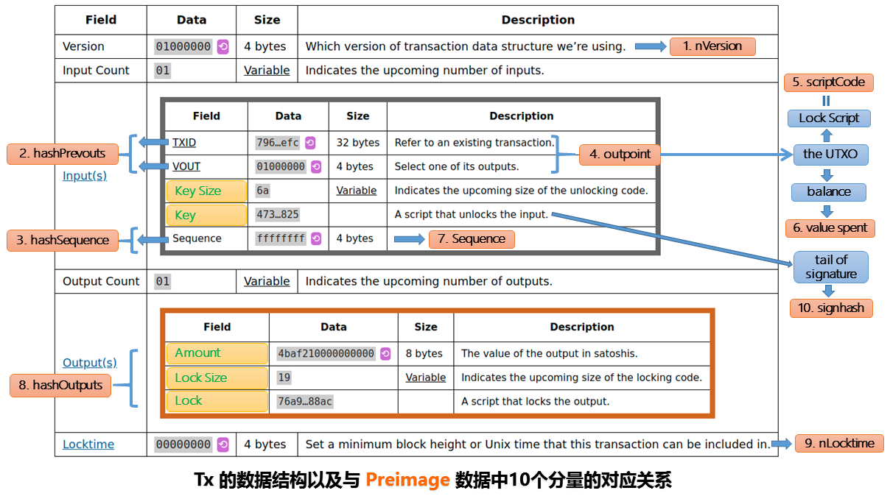

>注意：Preimage中的第9个分量 signhash 只表达了 Key 中紧随签名数据的附加数据，其表达签名的对象，并非签名本身，更与Key中的其他数据无关，从基本原理上，本文可以不考虑signhash取不同值时的影响。

[返回文章顶部](#top)

图中使用了的简称 Lock, 其对应业内专有名词：锁定脚本 / ScriptSig / LockingScript； 图中的简称 Key 对应专有名词 解锁脚本 / ScriptPubKey / UnlockingScript。

<span style="color:red"> 可以看到，Preimage中包含了当前 Tx 中除 Input_Count、Key_Size、Key（signhash除外）、Output_Count 以外的所有数据。因为在Preimage中，数据已经被重新序列化，所以，Preimage 未包含的 Count 或 Size 数据不再具有实用的意义。**需要注意：参考 [公式(1)](#math1) 中的 Lock_In_TxPre，当前 Tx_Output 中的 Lock 即是构造的新的 UTXO 锁： Lock_In_TxNow，其将成为 Lock_In_TxPre 验证函数的输入参数 `<Keys_In_TxNow>` 的一部分**。</span>

于是，[公式(1)](#math1) 可分解表达为

<span id="math2">

```html
公式(1)：
Lock_In_TxPre( <Lock_In_TxNow>, <TxPre_TXID>, <TxPre_VOUT>, ... ) == True 
```

这样清晰的表达了前一个 UTXO Lock (**Lock_In_TxPre**) 可以对花费它形成的新 UTXO Lock (**Lock_In_TxNow**) 进行约束，一层 spvToken 方案需要这一能力。


此外，对任何已知HASH值为 <**HashValue**> 的数据，可以通过在 **“脚本锁”** 中加入 `OP_HASH256 <HashValue> OP_EQUAL` 代码段来要求在解锁时输入正确的该数据，然后即可继续对数据进行变换与验证。虽然我们在构造一个确定格式的将会持续遗传的合约时，并不知道未来交易的 TXID，但是我们可以通过 OP_PUSH_TX 技术得到当前 TxNow 的输入 UTXO 的 TXID。两者结合，可以要求将正确的当前交易 TxNow 的父交易 TxPre 数据输入解锁合约中，而不需要在构造祖先合约时预指定 TxPre_TXID 。如此继续,可要求将正确的爷辈交易TxPrePre引入当前交易的合约验证过程中。这类将当前与祖辈的TX数据引入到合约解锁过程中的技术，可统称为 PUSH_TX 技术。在只考虑 `1-input-1-output` 的情况下，整个数据与流程如下：

1. 要求输入数据Data1
1. 执行计算TXID的Hash操作,得到TXID1
1. 跟Preimage中的TxNow_Input_TXID作比较
1. 结果相等,则输入的Data1=TxPre
1. 解析TxPre数据,得到其中的TxPre_Input_TXID
1. 要求输入数据Data2
1. 执行计算TXID的Hash操作,得到TXID2
1. 比较TXID2与TxPre_Input_TXID是否相等
1. 如果相等,则输入的Data2=TxPrePre
1. 对TxPre与TxPrePre做其他验证操作,或继续要求输入曾祖辈的交易数据

<!--center>PUSH_TX技术</center-->

<br> 


<span style="color:red">至此，本文讲述了一层 spvToken 方案所需要的完整的 PUSH_TX 技术，其包括：1）PUSH **当前 Tx** 中除 Key (UnlockingScript) 以外的其他数据到合约中；2）PUSH **祖辈 Tx** 中的完整数据，到 spvToken 合约中。这些链上数据也是所有其他类型的脚本合约的主要可操作数据（巧妇之米）。因为比特币脚本的图灵完备性质，当然可以构造任何可想到的谜语，来要求必须输入其对应的谜底数据，从而引入此谜底数据到合约解锁中。但是，**因为链上的数据的链式遗传特征，其谜底（祖辈交易数据）只有通过如上方式一层层的追溯来得到**。</span>


最后，我们考虑一下，为何无法通过 OP_CHECKSIG 来引入当前 TX 的 Key 数据呢？因为无法生成一个包含签名自身的签名。那么，此 Key 数据是否影响很大？接下来在spvToken的实现原理中，将解答此疑问。


<br> 

## 一层 spvToken 

有了前述的基本知识，后续就非常简单了。但首先，有必要给简单支付验证（SPV）下一个明确的定义，避免不同的内涵被不同的人混淆使用，增加迷惑性。

### 对SPV的明确定义

SPV的涵义是，交易数据的可靠性由且仅由矿工整体来保证。矿工之间以竞争加合作的方式得到的随区块延续而不断增加的整体工作量（POW）来对交易的有效性做出保证。其他人对交易的信任，即是对矿工整体的信任，任何多余的信任与验证都不是SPV的组成部分。实际上，一个交易一旦上链且具有足够的POW背书，那么其他生态的参与者不需要再对此交易做验证，甚至包括对自身利益相关的交易做验证（当然，如果只验证自己的数据，且很简单的话，也未尝不可，但此时表示你已经不相信SPV了）。

因此，我们引入一个与当前Token话题相关的论断，即：如果一个Token方案，其要求用户做除SPV要求的MerklePath验证以外的任何其他真伪验证工作(不包括查收其Token内容)，即便此验证工作是可靠的且不需要引入更多信任方，那么也破坏了SPV的原则，其也是不支持SPV的。其要么使得后续的接收人需要信任所有之前的接收人的验证，要么后面的用户需要将前面的用户的所有验证重做一遍，要么就需要引入对其他第三方的信任。

需要特别注意的是，即便对区块链原生的比特币的SPV验证，也要基于对矿工们历史验证结果的累加信任，并非只需要信任当前的矿工群体诚实性，任何历史的矿工群体的非诚实作为，也会破坏当前的SPV验证的可靠性。所以，相信当前矿工及历史矿工的可靠性是SPV验证的必要部分，也是绝大部分用户操作的依赖前提，这是系统足够安全并具备大规模扩容两个能力的平衡点。

### spvToken 设计原理

当前我们仅考虑 `1-input-1-output` 的Non-Fungible spvToken (NFT)。

回顾前面的介绍，我们可以要求 PUSH **当前 Tx** 中除 Key (UnlockingScript) 以外的其他数据，以及任何一个 **祖辈 Tx** 中的所有交易数据到 spvToken 合约解锁过程中，并将此称为 PUSH_TX 技术。基于此，可以实现 spvToken 的两个必要充分条件：

1. 当前交易 TxNow 输出合约，除 “地址Lock” 中表达接收者地址的数据发生变化外，其中的其他 Locks 必须与父交易 TxPre 的输出合约 Locks 保持一致。
1. 当前合约交易的根交易（指发行 Token 的交易）必须来自发行人地址，或者必须来自确定的 UTXO 交易（此条件可以用于约束合约的总量）。

第一个条件很容易达到，因为我们能 PUSH **当前 Tx** 中除 Key (UnlockingScript) 以外的其他数据，所以当然可以对其中的输出合约做出限制。

要达到第二个条件，是制作 spvToken 的关键部分，因为我们不能无限层级的向上检验祖辈交易。可以很自然的想到，我们
<span style="color:red">**可以通过迭代的方式来实现它，即 spvToken 合约在执行时只需要检验上一个交易（父辈交易）的诚实性即可。这样，当前交易验证了父交易的诚实性，父交易也已经验证了爷交易的诚实性，如此直达根交易，就会确保所有的祖交易都是诚实的。于是，只基于矿工群体对合约的验证工作，即可实现 spvToken，即可避免任何中间环节的不安全因素。**</span>

**检验父辈合约交易 TxPre 的诚实性，其包括检验其输入 TxPre_TXI 与输出 TxPre_TXO 两个部分的诚实性。**

#### 为何只检查父交易的输出TXO不行呢？

原理上，诚实性检查，它不只是形式检查，其目的是：**必须完整的保证父交易是由诚实的人，通过诚实的方式，生成了有效的输出。** 一旦交易链得到遗传并延长，后续不会再次重复此工作，所以需要非常小心的确保检查的完整性：验证输出是检查Token内容的有效性，验证输入是检查来源的诚实性。

技术上，因为即便输出的 TXO 形式与目标 spvToken 相同，其输入可能可以来源于非发行人的 P2PK 交易，如下图所示：

<!--
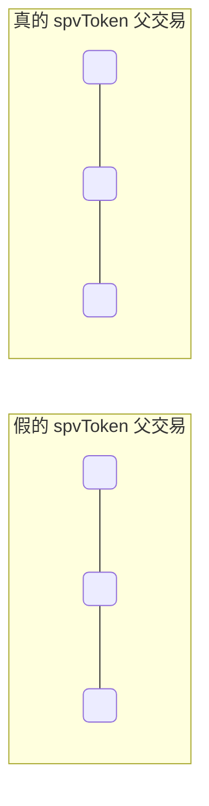
-->

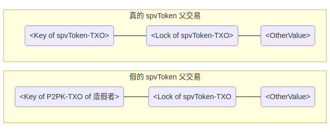

其中，不同的 Key 解锁不同的前序UTXO，但都可以生成同样形式的 spvToken-TXO。

<br>

#### 那么是否只检查父交易中包含的输入数据（如Key）即可？
这依然是不足的，因为，即使输入的 TxPre_Key 的内容形式一切如常，其可以是通过构造假的前置交易的Lock来实现。下图中使用 OP_True 作为 Lock 可以使得任何 Key 均可以正常解锁（其他的可行方式也是数不胜数的）：

<!--
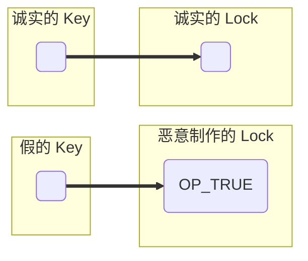
-->

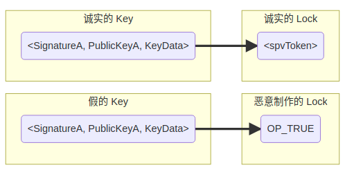

<span id="keyisnotimportant">

<span style="color:red">因此，我们必须通过检查 爷辈交易 TxPrePre 的 Lock， 来确保父辈交易 TxPre 中的 Key 是诚实的。这里，我们需要有在心中留下**一个系统的断言（亦或设计方向）：1）任何有意义的对 Key 的检查，都应通过检查前置交易的 Lock 来实现；2）一个有意义的 Lock 一旦被制造时，其 Key 应被约束，在 PUSH_TX 技术中几乎不会（不应）有检查 Key 的必要；3）Key 只在矿工将TX上链时（生成SPV签证）是必要的组成部分，在其他大多数情况下均是（可以是）一个不必要的负担**。</span> **这段回答了我们在介绍spvToken前提出的问题：Key 数据在上链时刻以外，并不重要**。

在极端的设计，如 BTC SegWit 交易中，此 Key 数据被完全隔离，不被包含在区块数据中，以此提高区块的有效数据容量。这当然是不可取的，用户被强制完全信任SPV验证，并因此完全依赖于矿工群体，失去了自我完整验证的能力。如果矿工合谋做伪账簿，其他方无法发现并证明其欺诈行为。SPV 是一种因信任矿工整体而得到的简单验证方法，适用大多数场景，但不可以成为非矿工群体的唯一的验证手段。本文中的提议自然会避免如此极端的设计。


#### 为避免 “鸡生蛋蛋生鸡” 失去源头，spvToken 的合约 Lock 也需要对某些特殊的 TxPrePre 放行。

我们可以不要求 TxPrePre 的 TXO 必须是 spvToken 形式的 Lock，其也可以具有 P2PK 交易形式的 Lock。但是，**应做其他约束：1）其 Lock 中的地址必须是发行人控制的地址，此地址将被遗传到任何子spvToken交易，也自然的成为发行人的标记；2）或者 TxPrePre 必须是某固定 TXID， 任何非继承于此 TXID 交易的 spvToken 均是无效的，真正基于一层实现了历史中的染色币概念，此时，spvToken也不再被发行人控制，严格禁止了任何增发操作。**


<span style="color:red"> 至此，我们已经在原理上完成了构造 spvToken 的思维实验，仅考虑 `1-input-1-output` 交易，其特别适合 NFT 类 Token，可将技术步骤总结如下：

1. 要求 PUSH TxNow_Preimage, 并用脚本检查 TxNow_Lock 是否符合 spvToken 标准且参数正确。
2. 要求 PUSH TxPre, 并检查 TxPre_Lock 是否符合 spvToken 标准且参数正确。
3. 要求 PUSH TxPrePre, 并检查:
   1. 其输出是否对应一个 spvToken Lock，是则验证通过，否则继续
   1. 其输出是否是一个标准比特币交易（如P2PK、P2PKH），且地址是 **合约内置地址** (如是则证明该spvToken确实是有内置地址指明的发行人发行的)。
   1. 判断此spvToken是否是不可增发Token，如是，则验证 TXID( TxPrePre ) =?= **合约内置TXID** ，如相等则验证通过。

其中每个一个检查失败，都意味着Token上链验证的失败，而只要脚本验证通过，则完成上链。一旦上链，则任何人可以进行SPV验证，不再需要执行脚本验证工作，所需要的只是将收到的 spvToken 交易中的 **合约内置地址** 与 **合约内置TXID** 解析出来，然后就知道收到了**哪一种合约**以及**是否是不可增发的合约**。
</span>

以上构建过程并非被充分优化，但是更加方便的表述了spvToken的基本原理。


*小思考：为何对原生代币不需要检查一个交易的输入的来源？而只需要交易输出的形式即可？*

### spvToken 的数据膨胀问题

以上构建的一层合约表现出了强大的功能，但是很不幸，其是无法实用的。

随着spvToken交易链的延长，每一个祖辈交易的完整数据，都要被PUSH进新的交易的 Input_Key 部分，以满足合约检查中 PUSH_TX 技术的需要。如下图所示，每一个新的交易（Tx:i）中的 Key 数据都包含其父交易（Tx:i-1）与爷交易（Tx:i-2）中的 Key 数据。因此，交易的体积会越大越大，直到手续费昂贵的无法承受。而且，用户在接受的 spvToken 时，也同样面临带宽与存储困难。

<!--
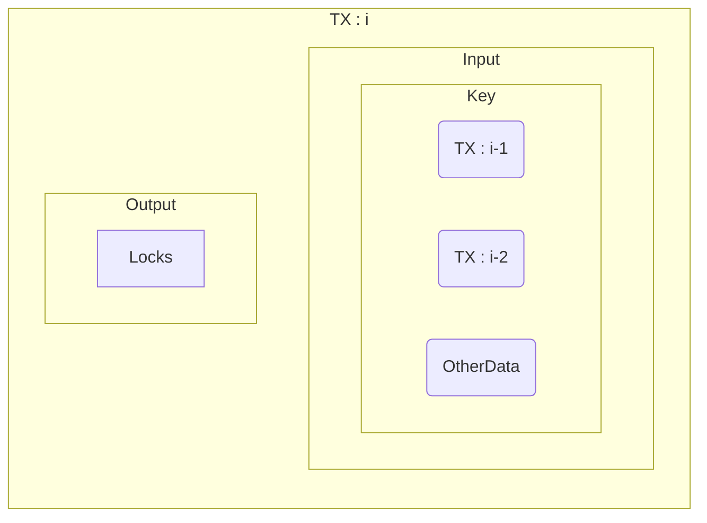
-->

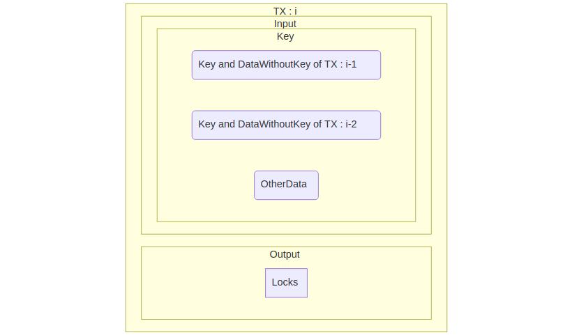


<br>

##  <font color="red"> 比特币改进提议 </font>

### <font color="red"> 最简提议 </font>

我们回顾文章开头的最简提议，讨论它如何解决spvToken的交易膨胀问题。

观察 spvToken 交易体积暴涨的原因，其重复数据仅在 Key 中继承并遗传。其根源在于，当前的 TXID 的计算是直接对交易的所有输入输出数据做二次 SHA256 HASH 运算得到:

<pre>
TXID = HASH( HASH( TX-Version:<mark>1/2</mark>,        <mark>Key</mark>, OtherTxData )) .
</pre>
<sup><sub><i>将 Key 换成 UnlockingScript，即为文章开头的表示。</i></sub></sup>


因此，当基于 TXID 在合约中引入其TX中的部分关键数据时，必须先将完整的交易数据代入，其称为 Key 的一部分，也包含历史交易中的 Key 数据。

我们已在[前文中](#keyisnotimportant)讲过：
    
>“Key 只在矿工将 TX 上链（生成 SPV 签证）时是必要的组成部分，在其他大多数情况下均是（可以是）一个不必要的负担”

因此我们需要将 Key 隐藏在历史中，不是抛弃它，不是像隔离见证(SegWit)一般将其排除在区块之外，而是像 Merkle 树一样将其 HASH 化，并放入区块的更远端的数据叶子上，即变为：

<pre>
TXID = HASH( HASH( TX-Version:<mark>3</mark>,  <mark>HASH(Key)</mark>, OtherTxData )) 
</pre>

做此改进之后，spvToken 交易中的 TxNow_Key 中不再包含 TxPre_Key 与 TxPrePre_Key, 此二 Key 将被具有不变大小的 HASH(Key) 代替。

图示如下：

<!--

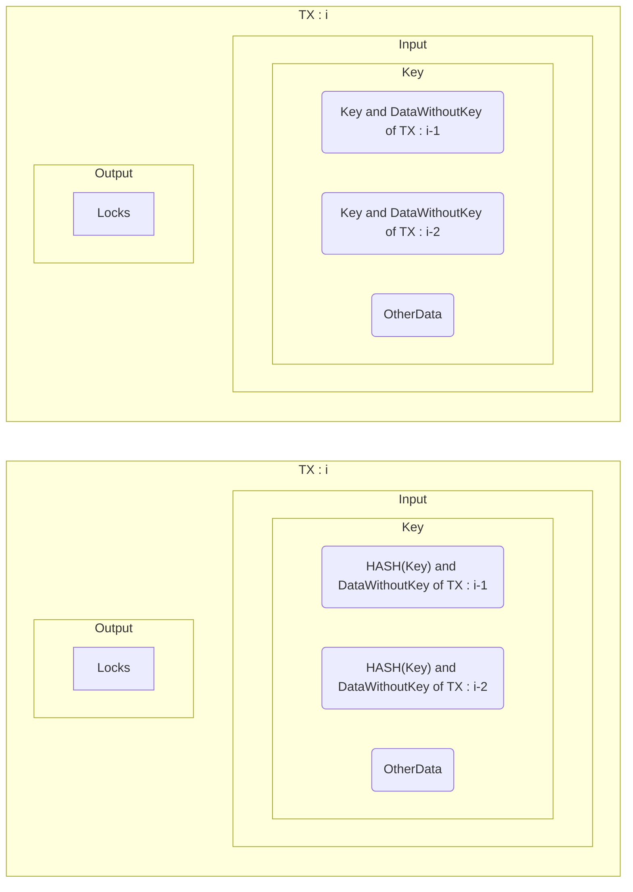
-->

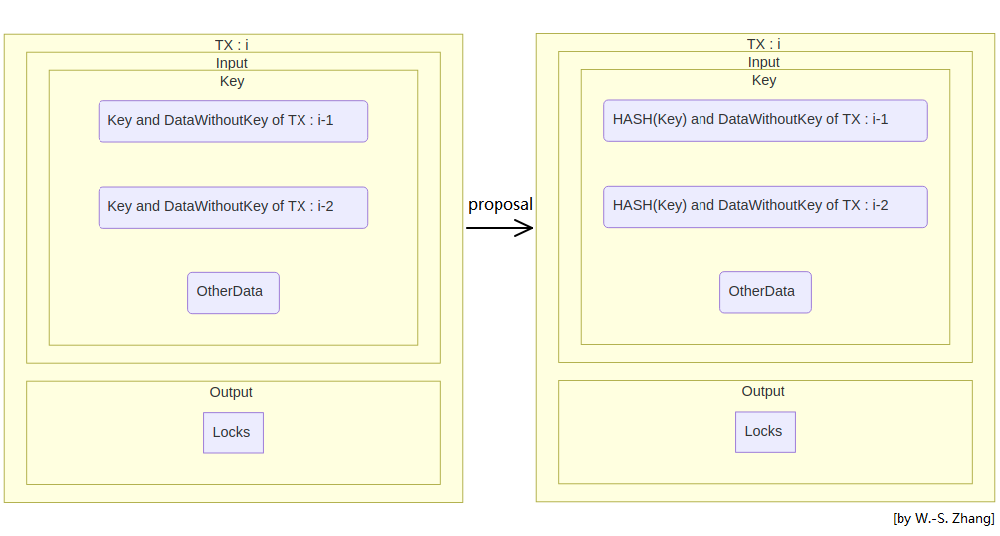

因此，经改进后，spvToken 交易将在链式增长时，遗传 Lock 特征的同时，保持恒定的 Key 的大小。

在之前的说明中，为便于解释，我们均使用 `1-inputs-1-outputs` 的交易来说明，并且也忽略了次要的 Key_Size 数据。

为更准确的解释提议，下图中使用了一个 `2-inputs-2-outputs` 的典型交易展示本提议与现有方案的区别。在最简版的提议汇总，每一个 Key 连同 Key_Size 一同被 Hash 化，然后占用原位置与其他交易数据合在一起，计算 TXID。

当前的节点软件中的TXID生成方法图示为：

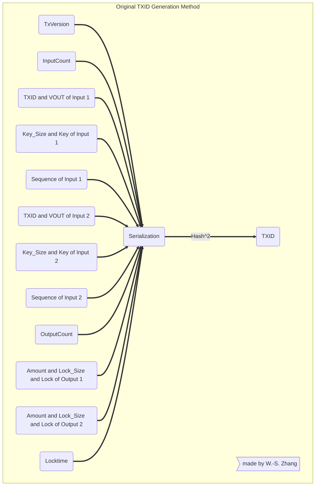

提议的最简版本的TXID生成方法可图示为：


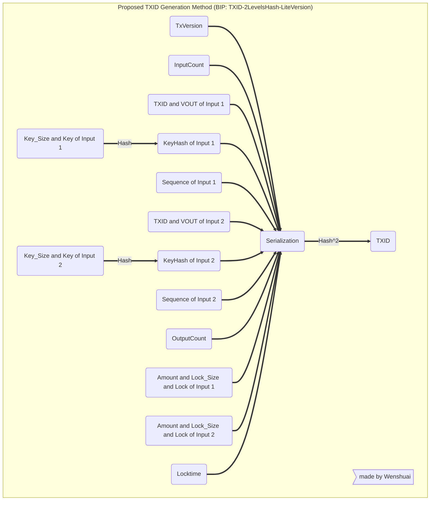


### <font color="red"> 完整提议 </font>


在考虑 `2-inputs-2-outputs` 交易，乃至具有更多输出数量的交易下的智能合约的时候，经常出现一种情况：智能合约需要检查的 UTXO 只是其所在TX中的其中一个。而且，如果在未来的交易中，用户希望将更巨大的数据的放置在 Outputs 中，那么对不同的 Outputs 做独立不合并的 PUSH_TX，就会比较必要与高效。

因此，我们需要做更多一点改进，将不同的 Outputs 也进行独立的 Hash，最后占用原位置，与其他数据一起计算出 TXID。此完整改进建议可图示如下：

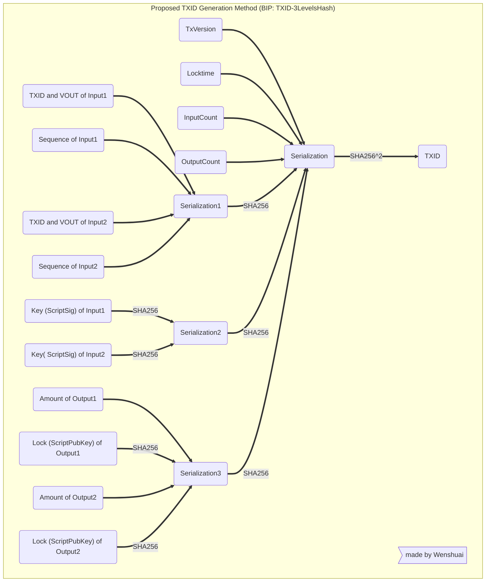

以上示意图可以用公式表达为：

```
TXID = SHA2562_Encode({
	 	Version(4Byte),
	    LockTime(4Byte),
	   	InputCount(4Byte,Little),
	    OutputCount(4Byte,Little),
	 	SHA256_Encode ({
			TxIn1:TXID, TxIn1:VOUT, TxIn1:Sequence  , 
			TxIn2:TXID, TxIn2:VOUT, TxIn2:Sequence  ,
			…                                       ,
			TxInN:TXID, TxInN:VOUT, TxInN:Sequence  ,
		}),
	 	SHA256_Encode ({
			SHA256_Encode ({ TxIn1:UnlockingScript }), 
			SHA256_Encode ({ TxIn2:UnlockingScript }), 
			                 …                       ,
			SHA256_Encode ({ TxInN:UnlockingScript }), 
		}),
	 	SHA256_Encode ({
			                TxOut1:Value            ,
			SHA256_Encode ( TxOut1:LockingScript )  ,
			                TxOut2:Value            ,
			SHA256_Encode ( TxOut2:LockingScript )  ,
			                …                       ,
			                TxOutM:Value            ,
			SHA256_Encode ( TxOutM:LockingScript )  ,
		}),
	    })

```


<span style="color:red">  **需要特别注意**: 在 FullVersion 的改进提议中，多出的一类 Hash 计算是对 `Amount + Lock_Size + Lock` 的 Output 整体进行。假如类似Key一般，只对 `Lock_Size + Lock` 进行 Hash 化，那么矿工可以在不给出 Lock 的情况下，说服其他矿工，其输出余额 Amout 是符合交易费率的，且其 TXID 的计算是可以通过 LockHash 验证的 。此时该交易可以成功上链，其表现如同 P2SH，这将使交易的透明度降低，对合法交易的审计造成了不必要的难题，且对非法交易提供了隐匿保护功能。因此，我们需要将 TXO 的 Amount 也加入到需 Hash 化的数据中，使用户与矿工在展示交易有效性的时候，必须提供包括 Lock 在内的 Output 的所有数据。</span>

**改完全版的改进提议，将可以实现极限的数据资源（存储与带宽）利用率**。因为除 KeyHash 与 OutputHash 以外的其他 “Serialization前” 数据均非常小，用户将不仅只需要存储自身相关的交易，还只需要存储相关交易中的相关部分，同样不失可验证性。


接近极限的数据资源（存储与带宽）利用率、必不可少的数据资源回收（数据裁剪）能力

<br>

## <font color="red"> 此改进简单与优雅吗？ </font>

**此改进足够简单：**

* 因为 TXID 计算的不可逆性，TXID的用途几乎仅在于索引TX数据，其最核心的需求是，不同的交易需要产生不同的TXID。所以 **TXID 的计算具有低耦合高独立性，只需要在所有需要计算或验证 TXID 的位置使用新的计算逻辑即可**，其不会影响任何其他部分的程序逻辑，不影响矿工使用交易数据全文（包括 Key 与 Lock）做脚本验证，不影响 SPV（简单支付验证）等等。

* 配合升级的 TX Version，来标记新老版本的交易需使用不同的 TXID 计算函数，**新老交易可以同时共存**，不会产生冲突。

* 生态应用方也不需要改动任何其他验证单元，也只需要增加一个新版本的 TXID 计算函数即可。

**此改进足够优雅：**

* 此改动是**延续了 Merkle Path 的数据可裁剪设计**，将其应用到 TX 内部，形成完整的数据裁剪需求。特别是 Key 数据一经矿工群体验证上链，其SPV将具有足够的安全性，保证Key数据即便超级大，也可以安全的移除。

* 此改动是大区块发展方向的必要组成部分，大区块中必然鼓励大的 TX，大的脚本执行能力。当脚本程序越来越大，其所需求的存储空间（图灵机中的纸带）也会越来越大。如同，现代计算机程序必须做内存垃圾回收，来维持图灵机的实用性。本改进也是**在纸带有限的客观条件下，实现对纸带的充分利用，使得比特币脚本的图灵能力得到最大程度的发挥，获得必不可少的资源回收（数据裁剪）能力**。

* <span style="color:red">  **此改进增强或补足了交易数据的遗传进化能力，为比特币系统打开了类似生物的无限进化可能**。</span> 类比生物，当二倍体细胞经过减数分裂产生单倍体的配子（精子与卵子）时，一部分染色体被分配到极体中，然后极体通常被降解。设想一下，如果没有不丢弃一些染色体，生物将无法进化，变异与垃圾清理都是必要的能力。 **对任何需要自我进化的比特币交易，其变异能力由图灵完备的计算机指令来实现，而垃圾清理能力则由本提议来实现，必须在保留（或激活）祖先有用数据的同时，清理（或归档）其中的陈旧无用部分**。

* **本改进没有删除与隔离陈旧的 Key 数据**，而是利用 Hash 技术将其隐藏至大多应用无需触及的更远端，**其仍然通过 HashValue 与 TXID 紧密关联在一起**。在任何需要其的时候，仍可以通过无需信任的 Hash 验证将其激活，这与 SegWit 技术中的妥协/蹩脚方案有根本的区别。

**此改进的共识可行性：**

* 历史上已发生过变更 TXID 计算方式的改动，本改动应该不会动摇系统的稳定性。

    历史上，发生过两次[不同交易具有相同 TXID 的情况](https://learnmeabitcoin.com/technical/txid)，block 91722 与 block 91880 的 coinbase 交易 TXID 是相同的，block 91812 与 block 91842 的 coinbase 交易 TXID 也是相同的，反应了 TXID 计算中的不成熟考虑。因此，也相应做过一次针对 TXID 计算方式的改进：[BIP 34](https://github.com/bitcoin/bips/blob/master/bip-0034.mediawiki) 

    > BIP 34 required coinbase transactions to include the height of the block the were mining in to their transaction data, so that coinbase transactions could be different.

* 在生态还未完全成熟之前 (生态的成熟或许也依赖此改进)，此改进的 收益 与 成本比很大，如果没有严重的漏洞，在充分被节点开发方、社区、矿工群体认识与理解之后，其具有较大的可行性。


<br>

## <font color="red"> 一劳永逸，真正实现 Set In Stone </font>

总结全文，我再次呼吁全体相关人严肃的考虑本项提议，在没有发现重大漏洞的情况下，推进该提议的实现，使比特币系统中的交易链具有可持续的遗传与进化能力。这些交易链，利用时间（历史与未来）来延伸比特币图灵完备脚本系统的操作空间，持续裁剪/凝聚/进化出实用(有用)的数据空间，形成一个无限长的纸带，实现功能上的无限进化，真正具备协议固定的技术能力。


<br>
<span id="mark">

## 符号与名词解释 

[返回文章顶部](#top)

本节解释某些必要的专业词汇。此外，为了使表达更加简洁、容易记忆，本文也用了一些自定义的名词简写与命名规则。

- **< ... >**： 表达一个字符串输入数据，其意义由中间的文字所描述。
- **Tx / TX / tx** ： 涵义相同，都表达交易 Transaction 的简称。可跳转至[TX数据结构](#preimagedate)查询其包含的数据内容。
- **LockingScript** ： 为锁定脚本，通常也被称为 ScriptPubKey，其中出现 PubKey 是因为：此脚本中通常包含公钥 PublicKey 信息 （用于指定开锁私钥）。[可跳转至[TX数据结构](#preimagedate)查询 ScriptPubKey 的记录方法]
- **UnlockingScript**： 表示解锁脚本，通常也被称为 ScriptSig，其中出现 Sig 是因为：在最常见的交易中其包含一些签名数据 Signature，即用私钥PrivateKey对交易内容做的签名，只有签名正确，交易才能通过矿工验证。[可跳转至[TX数据结构](#preimagedate)查询 ScriptSig 的记录方法]
- **Lock** ： 表达 “脚本锁”， 本文中用作锁定脚本 LockingScript 的简称。
- **Locks** ： 表达多个 “脚本锁”， 其可以表达一个交易输出TXO中的单个锁定脚本中的多个独立的条件锁；其也可以表达多个 TXOs 对应的多个锁定脚本；具体涵义视上下文决定。
- **Key** ： 表达 “脚本锁” 对应的 “钥匙”，是解锁脚本 UnlockingScript 的简称。
- **Keys** ： 表达“解锁钥匙”中的不同组份，可分别对应多个解锁条件的其中之一，表示一个锁需要多个钥匙的情况。
- **Unlock** ： 指用 Key（Keys）解锁 Lock（LockingScript）的过程。
- **PubKey** ： 公钥PublicKey的简写，可以用于验证某个签名确实是此 PubKey 对应的私钥（PrivateKey）所签署。
- **Inputs / Outputs** : 交易的输入与输出数据，可跳转至[TX数据结构](#preimagedate)查询交易的数据结构。
- **TXO** ： TX Output，交易输出，其中包括锁定脚本（Lock）与对应的余额（Balance）。
- **UTXO** ： Unspent TX Output，当前具有余额，还未花费的交易输出。当在新的TX中花费它时，需要在新的TX的inputs中用指针指定其所在位置。
- **Outpoint** ： UTXO的指针（等于 TXID 加 VOUT）。TXID 指明 UTXO 所在 TX， VOUT 指明其在此TX 中的 Output 的排序位置（排序计数从0开始）。
- **TXI** ： TX Iutput，交易输入。其包括 TXID、VOUT、Key_Size、Key、Sequence。
- **TxNow** ： 正在执行验证与上链的当前TX。
- **TxPre** ： TxNow中使用的UTXO所在的TX。每一个输入UTXO都对应一个TxPre，分别记为TxPre1、TxPre2 ... 。
- **TxPreCurrentUnlock** ： 当前正在执行Unlock验证的UTXO所在的TxPre: TxNow -> Current Unlocking UTXO -> TxPre， 仅指代一个Tx。 
- **TxNow_Input1** ： 当前 TxNow 的 Inputs 中的第一个 Input 数据：TxNow -> Input1，其包含以下数据： 1） TxPre1 的 TXID 与 UTXO 所在的 VOUT (两者组合起来即为Outpoint)； 2） 解锁脚本 Key； 3） 前一个数据（Key）的数据大小；4）控制交易是否及时上链的一个整数值 nSequence。


## 参考文档

1. https://scryptdoc.readthedocs.io/en/latest/contracts.html#contract-op-push-tx
1. https://github.com/sCrypt-Inc/boilerplate/blob/dev/contracts/spvToken.scrypt
1. https://xiaohuiliu.medium.com/peer-to-peer-tokens-6508986d9593
1. https://blog.csdn.net/weixin_47461167/article/details/108409290
1. https://wiki.bsv.info/scrypt
1. https://learnmeabitcoin.com/technical/transaction-data
1. https://blog.csdn.net/weixin_47461167/article/details/108442784


---

Bitcoin/SV Address of Author: 1PwCe2W28i1ymYGaHUDWoQTbQiat5B97b6

Copyright (c) 2021-2024 Wenshuai

---
